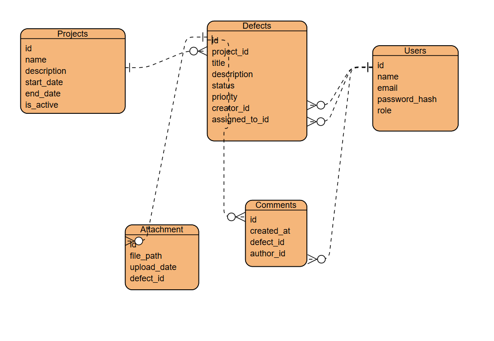

### system_control_defects
Цель разработки — создать монолитное веб-приложение для централизованного управления дефектами на строительных объектах. Система должна обеспечить полный цикл работы: от регистрации дефекта и назначения исполнителя до контроля статусов и формирования отчётности для руководства.

Система предназначена для:
- регистрации и классификации дефектов на строительных объектах;
- назначения ответственных лиц и сроков устранения;
- отслеживания статусов исправления дефектов;
- формирования аналитической отчётности для руководства и заказчика.

## ERD-diagram:

# Технологический стек:
1. Backend: Python (FASTApi)
2. Frontend: React JS
3. База данных: PostgreSQL

# Функциональные требования
1. Регистрация пользователей и аутентификация.
2. Разграничение прав доступа (менеджер, инженер, наблюдатель).
3. Управление проектами/объектами и их этапами.
4. Создание и редактирование дефектов (заголовок, описание, приоритет, исполнитель, сроки, вложения).
5. Управление статусами дефектов: Новая → В работе → На проверке → Закрыта/Отменена.
6. Ведение комментариев и истории изменений.
7. Поиск, сортировка и фильтрация дефектов.
8. Экспорт отчётности в CSV/Excel.
9. Просмотр аналитических отчётов (графики, статистика).

# Нефункциональные требования
1. Время отклика страницы ≤ 1 секунды (для 50 активных пользователей).
2. Обеспечить резервное копирование БД раз в сутки.
3. Интерфейс на русском языке, адаптивный под ПК/планшеты.
4. Совместимость с Chrome/Firefox/Edge последних версий.
5. Пароли хранить с использованием bcrypt или argon2.
6. Защита от SQL-инъекций, XSS и CSRF.
